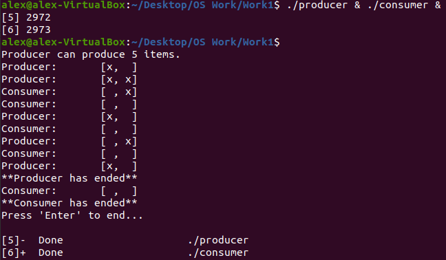
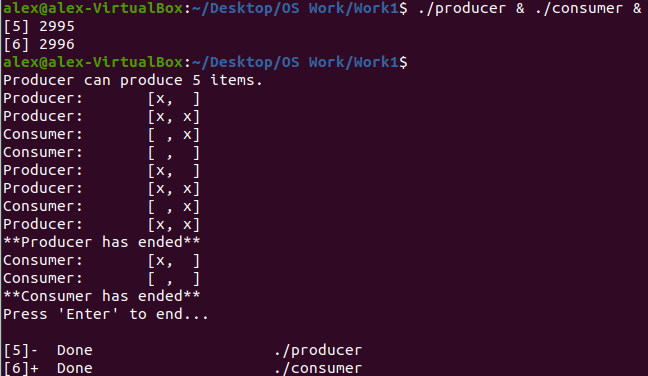

# Producer-Consumer Implementation
# Overview
This implementation is written in C and involves a producer process and a consumer process using shared memory, which is an array of size two. In order to prevent race conditions, semaphores are used for synchronization between the two processes.

# Features
- A visualization of a producer and consumer using a shared array, and each process prints out the new array onto the terminal after modifying it.
  - The producer process inserts an 'x' into the shared array.
  - The consumer process "consumes" the 'x' in the shared array.

  &nbsp&nbsp&nbsp

# Requirements
- A Linux environment is needed. If you do not have it, you can install [VirtualBox](https://www.virtualbox.org).
  - If the desired Linux environment is Ubuntu, you can download the iso file from https://ubuntu.com/#download.
  - A guide by Gary Explains explains how to use VirtualBox to install Linux (requires iso file above): https://www.youtube.com/watch?v=hvkJv71PsCs

# Usage
`$ gcc producer.c -pthread -lrt -o producer`  
`$ gcc consumer.c -pthread -lrt -o consumer`  
`$ ./producer & ./consumer &`  
* Note: If an error occurs, it is possible that there are shared memory files sharing the same name as the semaphores and shared memory used here ("full", "empty", "mutex", and "/buffer"). 
  * These files are in the directory `dev/shm` and should be deleted for proper functionality. 
  * The shared memory files should be removed from that directory automatically when all processes close and unlink them.
