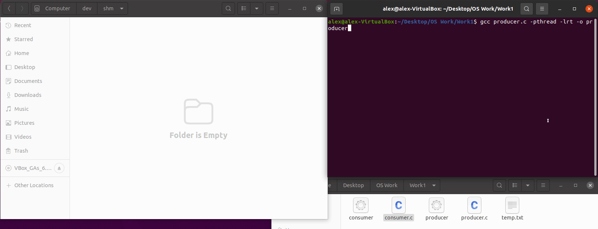
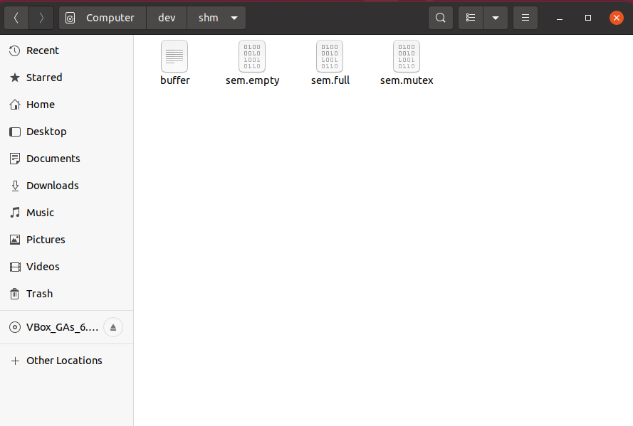

# Producer-Consumer Implementation
## Overview
This implementation is written in C and involves a producer process and a consumer process using Portable Operating System Interface for UNIX (POSIX) shared memory, which is a form of interprocess communication (IPC). The two processes are running at the same time, and both access the shared memory to modify an array. Without synchronization, they can access shared memory at the same time, which can cause undesired results. This is known as a race condition, and in order to prevent it, semaphores are used for synchronization between the two processes. In this implementation, semaphores are used to allow only one process into the critical section (the shared array), to make the producer wait if the array is full, and to make the consumer wait if the array is empty.

## Features
- A visualization of a producer and consumer using a shared array, and each process prints out the modified array onto the terminal.
  - The producer process inserts an 'x' into the shared array.
  - The consumer process "consumes" the 'x' in the shared array.
- Can modify (must be the same for both programs):
  - `#define bufferSize` to change the size of the array in shared memory.
  - `int numOfLoops` to change how many times the producer and consumer will modify the array in the shared memory.

  
  

## Requirements
- A Linux/UNIX environment is needed because Windows does not support the UNIX header files used in this implementation. If you do not have it, you can install [VirtualBox](https://www.virtualbox.org).
  - If the desired Linux environment is Ubuntu, you can download the iso file from https://ubuntu.com/#download.
  - A guide by Gary Explains explains how to use VirtualBox on Windows to install Linux (requires iso file above): https://www.youtube.com/watch?v=hvkJv71PsCs

## Usage
`$ gcc producer.c -pthread -lrt -o producer`  
`$ gcc consumer.c -pthread -lrt -o consumer`  
`$ ./producer & ./consumer &`  
* Note: If an error occurs, it is possible that there are shared memory files sharing the same name as the semaphores and shared memory used here ("full", "empty", "mutex", and "/buffer"). These files may not have been removed due to premature end of this implementation, or another implementation using the same name for shared memory failed to close and unlink them.
  * These files are in the directory `/dev/shm` and should be deleted for proper functionality. 
  * The shared memory files should be removed from that directory automatically when all processes close and unlink them.

  

